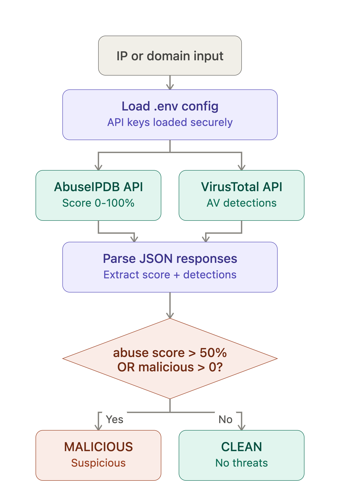
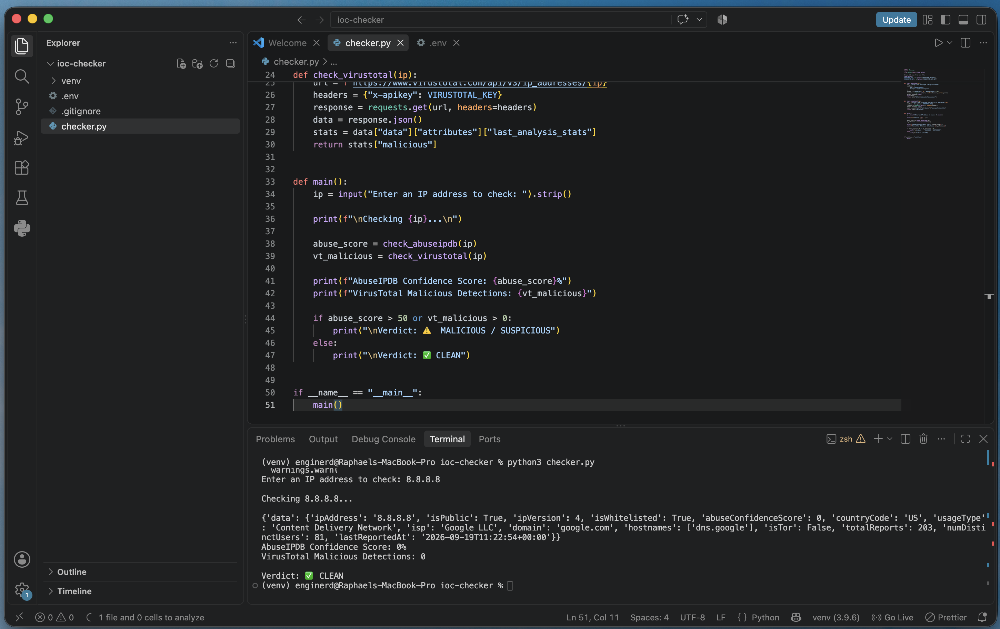
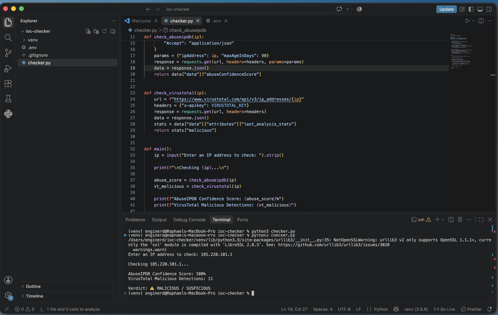

# IOC / Threat Intel Checker

## Project Overview

A lightweight Python CLI tool that checks an IP address against two independent threat intelligence sources — AbuseIPDB and VirusTotal — and returns a combined verdict (Clean or Malicious/Suspicious).

Built as a practical SOC/Blue Team portfolio project to simulate real-world IOC triage: never trusting a single feed, and correlating multiple sources before making a call.

## Architecture

User input (IP) → Python script → queries AbuseIPDB + VirusTotal APIs in parallel → aggregates results → prints verdict to terminal.



## Features

- Queries AbuseIPDB for historical abuse confidence score (0–100%)
- Queries VirusTotal for malicious detections across ~70 antivirus engines
- Combines both signals into a single Clean / Malicious verdict
- API keys stored securely via `.env` (never hardcoded, excluded from version control)

## Skills Demonstrated

- API integration and authentication (AbuseIPDB, VirusTotal)
- Secure credential management (.env, .gitignore)
- Multi-source threat correlation — a core SOC triage habit
- Python scripting for security automation

## Tools & Tech Stack

- Python 3
- `requests` — HTTP calls to both APIs
- `python-dotenv` — secure environment variable loading

## Screenshots

**Clean IP Result (8.8.8.8):**


**Malicious IP Result (185.220.101.1):**


## Setup

1. Clone this repository
2. Create a virtual environment and activate it:
```bash
   python3 -m venv venv
   source venv/bin/activate
```
3. Install dependencies:
```bash
   pip install requests python-dotenv
```
4. Create a `.env` file in the project root: